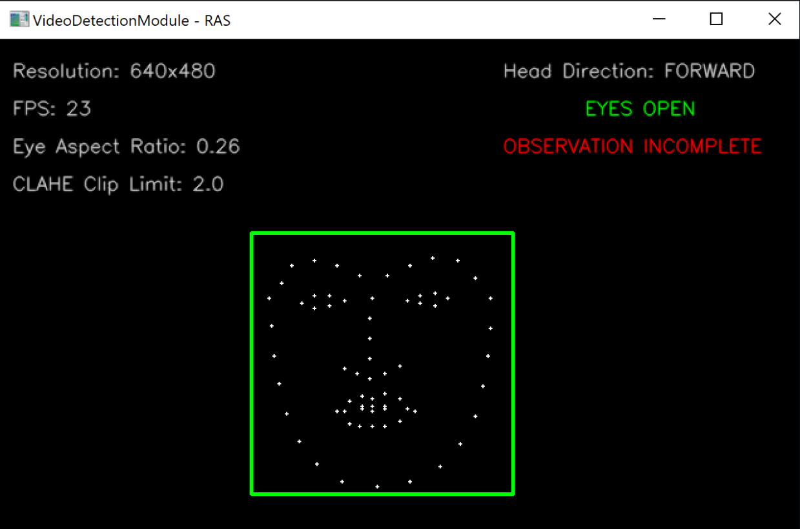
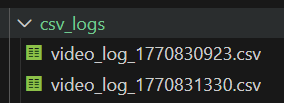
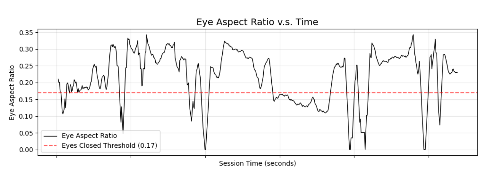
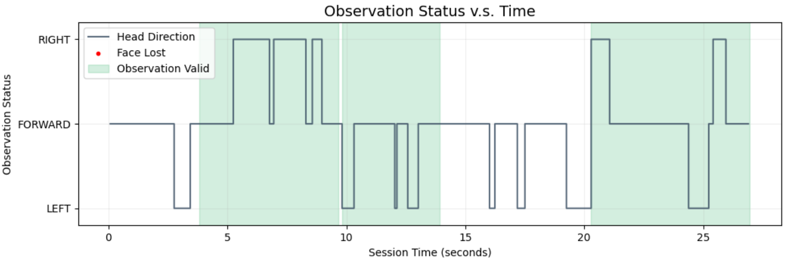

# VideoDetectionModule-RAS
### Introduction
This README.md has been developed for the Video Detection Module of the Risk Avoidance System (MJ03 Capstone Engineering Design Project).

### Installation:
Download the required python dependencies through pip:
``` pip install -r requirements.txt ```

<details>
  <summary>Extra Installation Procedures</summary>

  If the provided dlib 68-landmark predictor model is not working:
  1. Navigate to https://dlib.net/files/.
  2. Download ```"shape_predictor_68_face_landmarks.dat.bz2"```.
  3. Decompress the file using ```bzip2 -d shape_predictor_68_face_landmarks.dat.bz2"```.
  &emsp;3a. Windows users can alternatively use WinRAR for decompression.
  4. Move the file into the directory ```VideoDetectionModule-RAS/models/```.
  &emsp;4a. Models placed in other directories need to be referenced with the ```--dlib_model``` command line argument.
</details>


### Usage
The default visualization can be run with ```python3 detect_drowsiness.py```, but the script offers various command line arguments for users to customize their experience.

<details>
  <summary>Optional Flags</summary>

  ```
  usage: detect_drowsiness.py [-h] [-ll {DEBUG,INFO,WARNING,ERROR,CRITICAL}] [-fps TARGET_FPS] [-m DLIB_MODEL] [-s] [-e EAR_THRESHOLD] [-o OBSERVATION_WINDOW]
                              [-da] [-p] [-l]

  options:
    -h, --help            show this help message and exit
    -ll {DEBUG,INFO,WARNING,ERROR,CRITICAL}, --log_level {DEBUG,INFO,WARNING,ERROR,CRITICAL}
                          Logging level to use with logging library
    -fps TARGET_FPS, --target_fps TARGET_FPS
                          Target FPS for video processing
    -m DLIB_MODEL, --dlib_model DLIB_MODEL
                          Path to the Dlib landmark prediction model
    -s, --show_simple     Show landmarks on a black canvas instead of raw video
    -e EAR_THRESHOLD, --ear_threshold EAR_THRESHOLD
                          Eye aspect ratio threshold for detecting drowsiness
    -o OBSERVATION_WINDOW, --observation_window OBSERVATION_WINDOW
                          Observation safety window in seconds
    -da, --disable_annotation
                          Disable annotation on video output
    -p, --plot            Generate performance and metric plots on exit
    -l, --log             Enable csv logging
  ```
</details>

### Visualizer Overview
To show a simplified real-time view of what the module is doing, users can run ```python3 detect_drowsiness.py -s``` to see the facial landmark detection, along with system and driver statuses. The figure below showcases the simple operating mode, but users may run the script with optional flags to control the target ```--fps```, ```--ear_threshold``` which governs when eyes are reported "CLOSED", and ```--observation_window``` to analyze oncoming traffic from both directions.



### Logging Utilities
The system use two logging methods to separate inter-module communication for the Risk Avoidance System (RAS) from post usage analysis logs.
#### JSON Payload
The file: ```json_statuses/video_status.json``` is used as a one-time status output that combines with other modules of the RAS system to classify a risk rating. The information stamped in this payload annotated on the real-time visualizer, but not stored. Users can listen to the outputs through the provided listener script.

<details>
  <summary>json_listener.py</summary>

  1. Open a new terminal window.
  2. Ensure detect_drowsiness.py is running.
  &emsp; i.e. ```python3 detect_drowsiness.py```
  3. Run the listener with json_listener.py.
</details>

#### CSV Log Files
By using the optional flag ```-l``` or ```--log```, the script will record and store a .csv file in ```csv_logs/``` with the timestamp of your session.
<br>


Each log file contains a record of the eye aspect ratio, head pose, and observation validity over time, which can be used for analysis purposes, debugging, or report generation through the provided script.

### Report Generation
To simplify data presentation, a graphing utility has been provided that users can invoke on recorded csv files.

<details>
  <summary>generate_reports.py</summary>

  1. Complete a core script session with the ```--log``` flag to record  a .csv file.
  &emsp; i.e. ```python3 detect_drowsiness.py --log```
  2. Run the report script using ```python3 generate_reports.py``` to generate graphs using the latest session data.
  &emsp; 2a. To create reports on previously run sessions, use the ```-f``` or ```--file_target``` flag to point to the log file you want in ```csv_logs/```
  &emsp;&emsp;e.g. ```python3 generate_reports.py -f csv_logs/video_log_1770830923.csv```
  3. Generated outputs will appear on screen, and also be saved in the ```reports/``` directory.
</details>

<br>
Currently, the following graphs are supported. Example images provided below.

<figure>
  
  <figcaption align="center">
    <i><b>Figure 1:</b></i> Quickly identify moments where a driver closed their eyes with the eye aspect ratio dropping below the red threshold line.
  </figcaption>
</figure>

<br>
<figure>
  
  <figcaption align="center">
    <i><b>Figure 2:</b></i> Identify zones of proper driver observation by displaying head position over time. Session timestamps allow examination of entering and exiting safe observation windows (highlighted in green).
  </figcaption>
</figure>

